# Ay Işığı Tatlıcısı: Sipariş Yönetim Sistemi

Tek bir tatlıcı için web üzerinden sipariş alma ve yönetim sistemi.
Canlı: https://ayisigitatlicisi.com

## Ne yapıyor

müşteri menüden sipariş verebiliyor, işletme sahibi admin panelinden
siparişi anlık görüntüleyebiliyor ve ürün yönetimi yapabiliyor, müşteri SMS ve e-posta bildirimi alıyor.

## Ekran görüntüleri

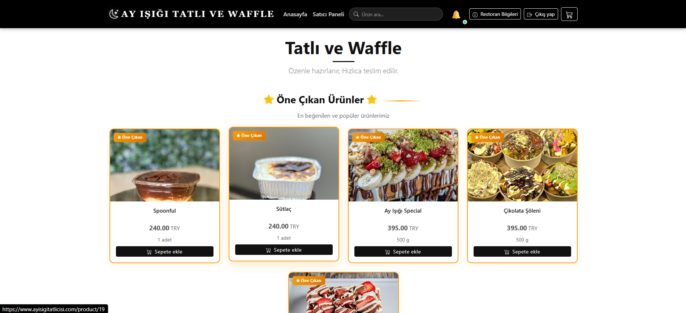
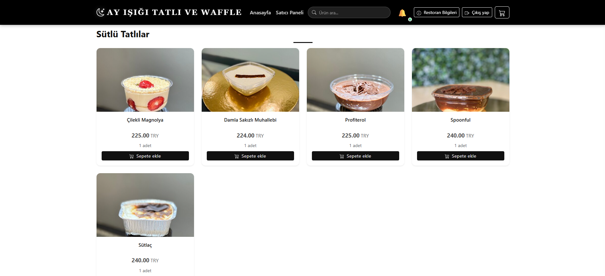
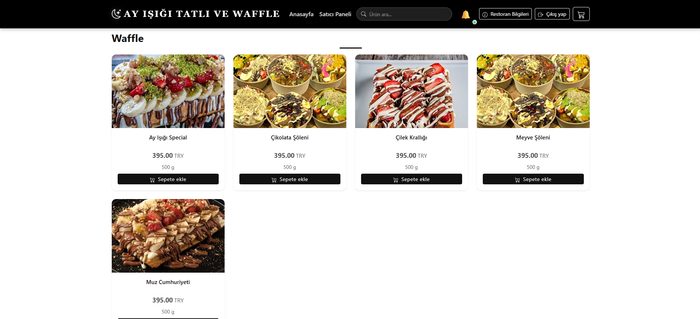
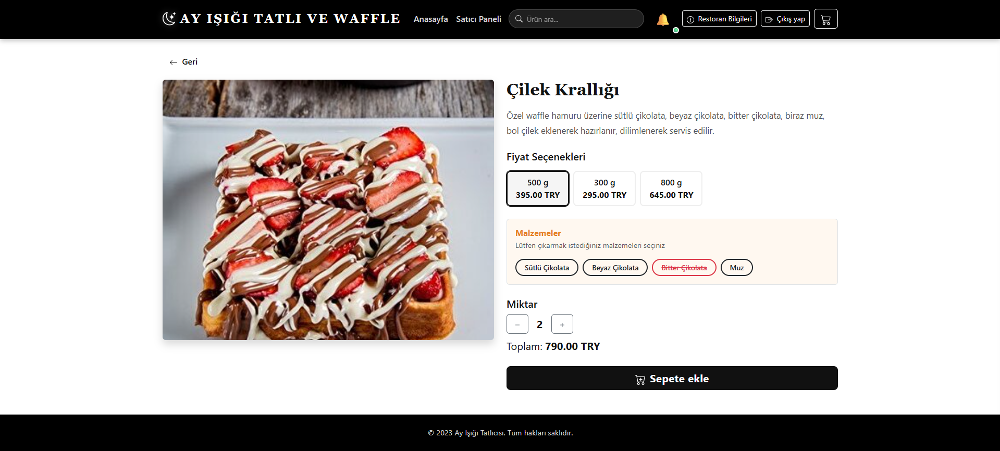
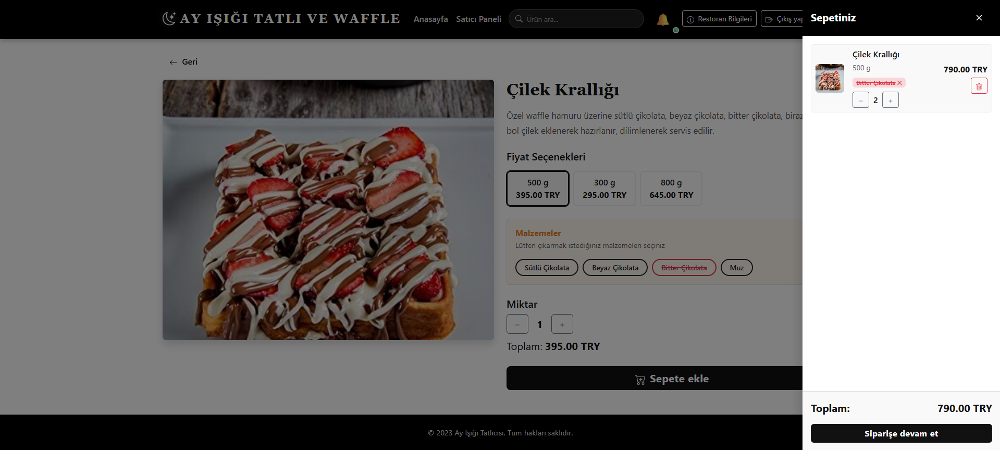
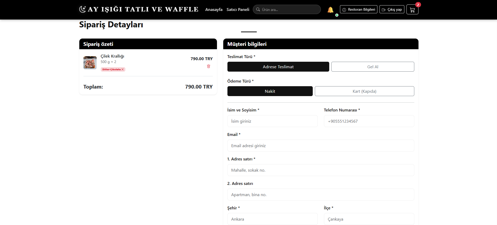
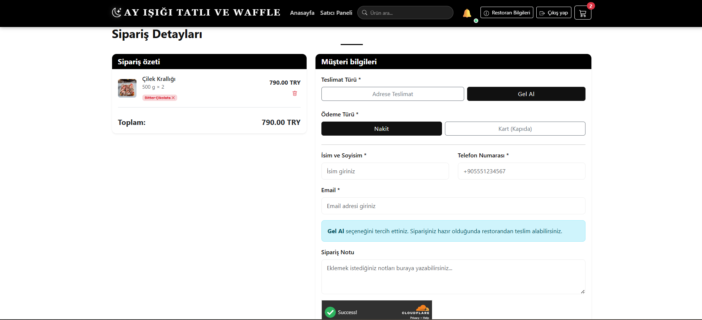
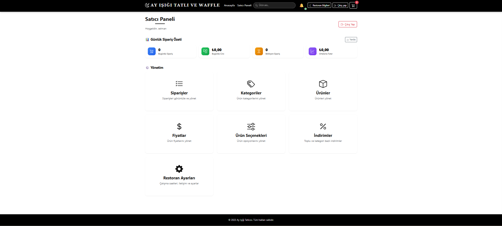
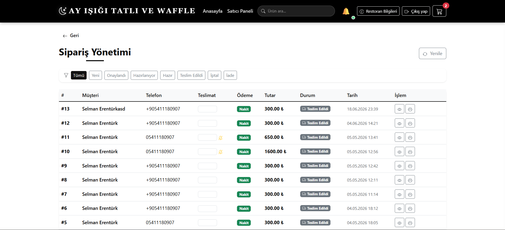
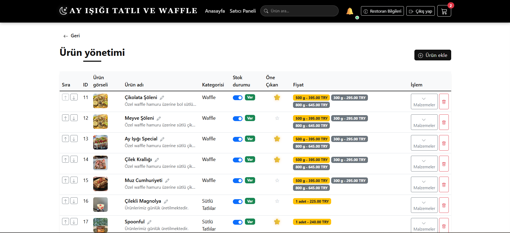
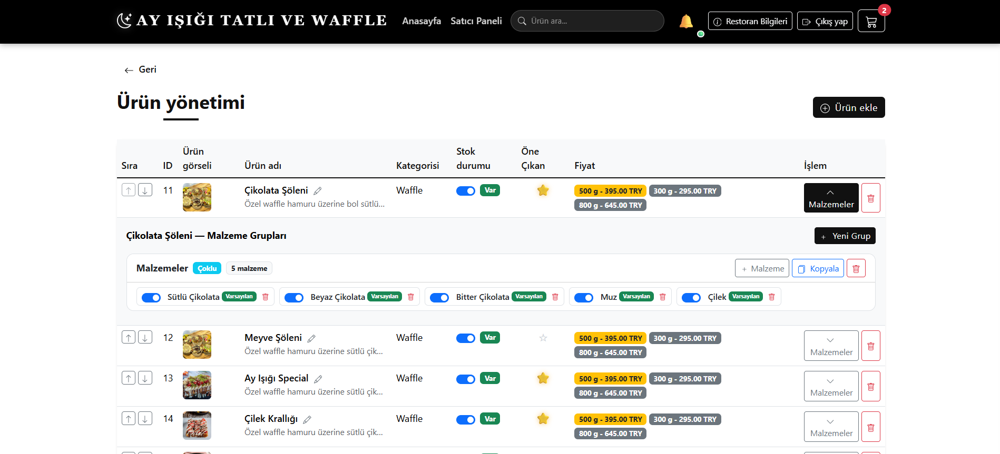
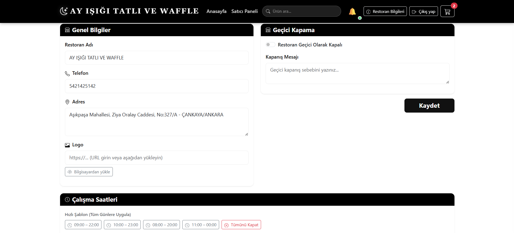

## Mimari

React (Vercel) -> FastAPI (Render) -> PostgreSQL

- Supabase Storage (görseller) + Twilio (SMS)

Backend katmanları:

- api/ HTTP endpoint'leri
- schemas/ Pydantic request/response modelleri
- CRUD/ veritabanı işlemleri
- models/ SQLAlchemy tabloları
- services/ bildirim ve dosya depolama servisleri

## Teknolojiler

Python, FastAPI, SQLAlchemy, PostgreSQL, React, Redux Toolkit, Vite,
WebSocket, JWT, Twilio, Supabase Storage

## Öne çıkan özellikler

- Yeni sipariş admin paneline WebSocket ile anlık düşüyor
- SMS (Twilio) ve e-posta bildirimi
- JWT + bcrypt kimlik doğrulama, public endpoint'lerde rate limiting
- Cloudflare Turnstile ile bot koruması
- Ürün, kategori, fiyat, ürün opsiyonu ve indirim yönetimi admin panelinden

## Kurulum

Frontend: npm run dev
backend: py -m uvicorn app.main:app --update

## Karşılaştığım problemler ve çözümleri

- Deploy sonrası ürün görselleri kayboluyordu. Sunucunun dosya sistemi kalıcı değil,
  her deploy'da yüklenen dosyalar siliniyordu. Yüklemeleri Supabase Storage'a taşıdım.
- İlk ziyaretçi 10 saniye bekliyordu. Ücretsiz planda backend 15 dakika hareketsizlikten
  sonra uykuya geçiyor. GitHub Actions ile 10 dakikada bir ping atan bir job ekledim.
- Seller Dashboard bir auth korumasına sahip değildi ve herkes bu kısıma erişebiliyordu,
  bende tek kullanımlık scriptler hazırlayıp seller kayıtlarını burdan almayı denedim.
  Şu an sorunsuz çalışıyor ve aynı zamanda unutulan passwordlar için reset scripti de yazdım.
